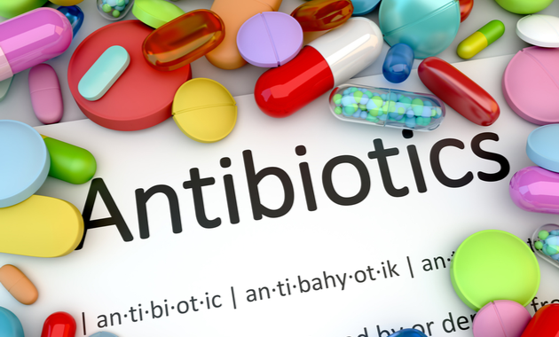

Yo'q. Antibiotiklar viruslarga qarshi foyda bermaydi. Ular faqatgina bakterial infektsiyalar uchun ishlatiladi. COVID-19 virusdan kelib chiqadi, shuning uchun antibiotiklar xech qanday davoga ega emas. Antibiotiklar COVID-19 ning oldini olish yoki davolash vositasi sifatida ishlatilmasligi kerak. Kasalxonalarda shifokorlar ba'zida og'ir kasal bemorlarga COVID-19 asoratlariga olib keladigan ikkilamchi bakterial infektsiyalarni oldini olish yoki davolash uchun antibiotiklardan foydalanishadi. Ular **faqat bakterial infektsiyani** davolash uchun **shifokor ko'rsatmasi** bo'yicha **qo'llanilishi kerak**.

###### Muallifdan:

Ushbu maqola JSST tashkilotining [ushbu saxifasi](https://www.who.int/emergencies/diseases/novel-coronavirus-2019/question-and-answers-hub/q-a-detail/q-a-coronaviruses) tarjimasi bo'lib, davolanishdan avval albatta shifokor bilan maslaxatlashishingizni so'raymiz. Xatolar va kamchiliklarini ushbu pochtaga yuborishingiz mumkin **muslimchik.inha@gmail.com**

