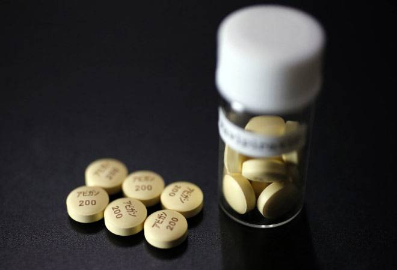

## [Business Today](https://www.businesstoday.in/sectors/pharma/coronavirus-drug-clinical-trial-of-fujifilm-avigan-drug-yields-inconclusive-results/story/409474.html) saytida aytilishicha ushbu dori vositasi kutilgan natijani bermagan.

Fujifilm Holdings Corp kompaniyasi tomonidan ishlangan 'Avigan' dori vositasining (tarkibida Favipiravir bor) klinik sinovi COVID-19 davolashda kutilgan natijalarni bermadi, deb yapon tadqiqotchilari 10-iyul 2020 yil xabar berdi . Fujita sog'liqni saqlash universiteti tadqiqotchisi Yoxey Doining so'zlariga ko'ra, sinovning boshida preparatni qabul qilgan bemorlar kechiktirilgan dozalarga qaraganda ko'proq ijobiy ta'sirlarni sezishgan, ammo natijalar statistik ahamiyatga ega bo'lmagan.

10-iyul 2020 yil kuni bo'lib o'tgan matbuot anjumanida e'lon qilingan natijalar mart va may oylari orasida Yaponiya bo'ylab 89 bemorda o'tkazilgan klinik sinovlar yakunlandi. Yaponiya Bosh vaziri Shinzo Abe, ushbu dori may oyida COVID-19 davosi sifatida tasdiqlanadi deb umid qilgan edi, ammo Yaponiyada bemorlarning yetishmasligi klinik sinovlar jarayonini kechiktirdi. Ushbu vosita xozirda Rossiya va Hindistonda COVID-19 davolash usuli sifatida tasdiqlangan.

## Lekin yana bir [Yapon axborot agentligida](https://www.japantimes.co.jp/news/2020/07/18/national/science-health/fujifilm-start-another-avigan-study-kuwait-following-setback-japan/#.XxQWdHUzZhE) sinovlar qaytadan Quvayt davlatida boshlanishini e'lon qilingan

Fujifilm Holdings Corp. Quvaytda Hindistonlik hamkorlari bilan 'Avigan' virusiga qarshi dori vositasi ustida klinik o'rganishni qayta boshlaydi, deya xabar 18-iyul 2020 yil kuni berdi.

Sinov jarayoni asosan Hindistonning doktor Reddy's Laboratories Ltd kompaniyasi tomonidan o'tkazilishi kutilmoqda va unda grippga qarshi dori samaradorligini baholash uchun 1000 nafargacha odam qatnashadi, deya xabar beradi.

Jons Xopkins universiteti ma'lumotlariga ko'ra Quvaytda 18-iyul kuniga ko'ra 58,200 dan ortiq COVID-19 holatlarini qayd etgan. Agar Kuvayt tadqiqotidan samarali natijalar olinsa, undan Yaponiyada ham foydalanish kutilmoqda.

Bosh vazir Sindzo Abe, may oyining oxirida koronavirusga qarshi kurashishda ushbu doridan foydalanish rasman tasdiqlanishiga umid qilgan edi, ammo o'sha oy Fujita sog'liqni saqlash universitetining Aviganning COVID-19 ga qarshi samarali emasligi haqidagi hisobotidan keyin u bundan voz kechdi.

###### Muallifdan:

Ushbu maqola **internet manbalarining tarjimasi bo'lib**, davolanishdan avval albatta shifokor bilan maslaxatlashishingizni so'raymiz. Xatolar va kamchiliklarini ushbu pochtaga yuborishingiz mumkin **muslimchik.inha@gmail.com**

