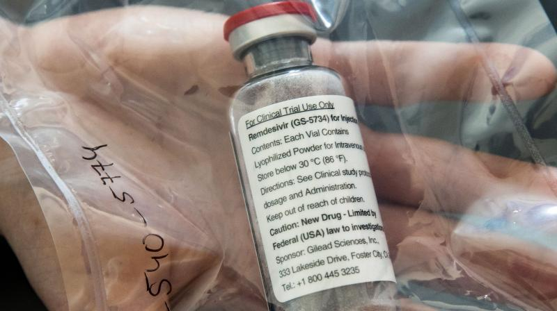

## Qanday o'tkazildi?

Sinovda preparatning besh kunlik va o'n kunlik davolash standardlari asosida va shuning bilan bir paytda boshqa bir guru bemorlar platsebo dori vositalari bilan davolash kurslar olib borildi. Ma'lumotlarga ko'ra, besh kunlik remdesivir bilan davolash kursidagi bemorlar 11-kunida tibbiy yordam standartlariga qaraganda 65% ko'proq klinik yaxshilanishlarga ega bo'lishgan. 

Kompaniya ta'kidlashicha, remdesivirni davolashning o'n kunlik davolash kursi kutilgan natija bermagan, ammo tibbiy yordam standartiga nisbatan klinik holatni yaxshilagan. Olimlar har ikkala davolash guruhida remdesivir bilan bog'liq yangi xavflarga duch kelishmadi. Preparat umuman olganda bemorlar tomonidan yaxshi qabul qilingan.

Olimlardan biri _Merdad Parsi_ shunday dedi: 
> "Bugungi natijalar shuni ko'rsatdiki, o'rtacha ahvoldagi kasallikni davolashda, besh kunlik remdesivir davolash kursi ushbu dorisiz davolashga qaraganda klinik jihatdan 
> ko'proq yaxshi natijalarga olib keldi va remedesivirning ijobiy natijalari xaqida dalillariga yana bir dalil bo'lib ushbu tadqiqot o'z natijasini qo'shadi.

'The National Institute of Allergy and Infectious Diseases' tomonidan olib borilgan tadqiqotlar remdesivirning davolanish muddatini qisqartirishi va avvalgi davolash usullaridan ko'ra ko'proq ijobiy natijalarni ko'rsatdi.

"Bizning sodda-jiddiy (SIMPLE-Severe) nomli tadqiqotlarimiz shuni ko'rsatdiki, og'ir kasallikka chalingan bemorlarni davolashda, besh kunlik remdesivir, o'n kunlik kursga o'xshash natijalarni ko'rsatdi."

'SIMPLE' sinovida kasalxonaga yotqizilgan Covid-19 bemorlarida pnevmoniya borligi tasdiqlangan, lekin kislorod miqdori kamaymaganlar tanlab olingan.

Sinovning birlamchi yakuniy bosichi 11-kundagi klinik holat deb belgilab olingan, bunda kasalxonadan javob berish, yuborilayotgan kislorod miqdorini oshirish, sun'iy nafas berish qurilmasiga ulash va o'lim bilan yakunlangan. Ikkilamchi maqsad esa sinovlar yakunida, har bir remdesivir qabul qilgan bemorlar guruhidagi salbiy natijalarning remesidivirsiz davolash kurslariga nisbatan xajmini o'lchash va ijobiy holatlarni o'rganish qilib belgilangan.

Ushbu preparat Yaponiyada Covid-19 kasalligini davolash uchun tasdiqlangan va AQSh oziq-ovqat va dorilar boshqarmasi (FDA) og'ir xoldagi Covid-19 bemorlarni davolash uchun favqulodda foydalanish uchun ruxsatnoma oldi. 

